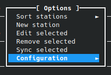
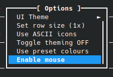
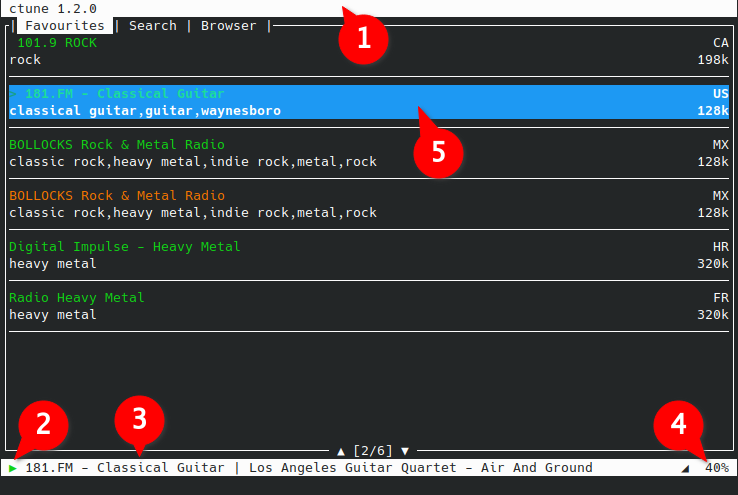
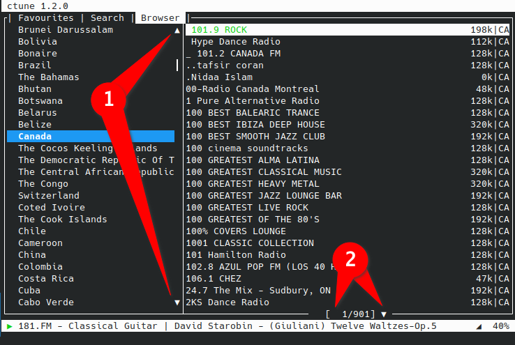
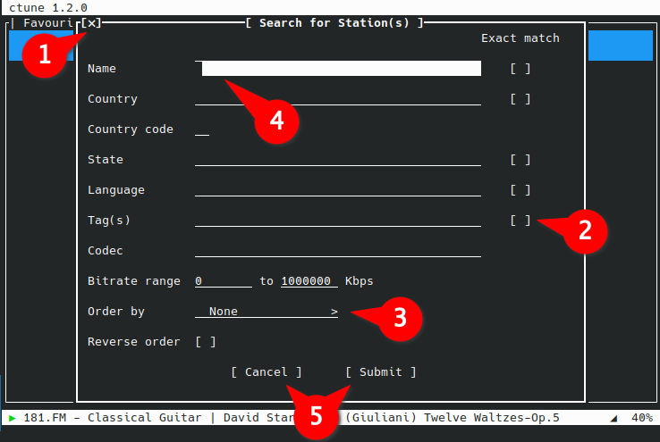

# Mouse Navigation Guide

Mouse support must be enabled inside the Options menu (`O`) first (`Configuration` sub menu → `Enable Mouse`).

## Main window and lists

1. Right click the title bar area to open the configuration menu
2. Left click to start/stop a queued station
3. Right click queued station name to open the information dialog
4. Volume: Left click to increase the volume and right click to decrease it.
5. 1. Single left click to select a list item
   2. Double left click to queue and play the station
   3. Right click to show the station's information.

## Browser tab and list scrolling

1. Left click on arrows to scroll in the direction
   Right click on arrows to scroll to the beginning or end of the list
2. Left click on arrows to scroll in the direction
   Right click on arrows to scroll to the beginning or end of the list

1. Left click to close dialog
2. Left click to toggle checkbox
3. Left click on either half to select desired option
4. Left click to select the field, then another to position the cursor inside of it
5. Left click to push button